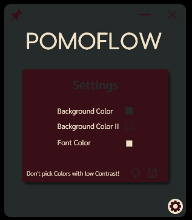
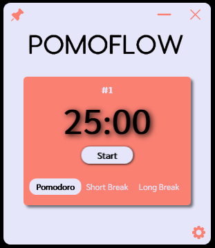

# PomoFlow  

PomoFlow is a project designed to simplify the use of the Pomodoro technique. It allows users to customize colors to their preference and eliminates the need to manually set timers on a phone.  

## Why did I choose this project?  

As someone who actively uses the Pomodoro technique, I wanted a more streamlined way to manage my focus sessions without having to manually set timers on my phone. This project provides an efficient and customizable solution.  

## What did I learn from this project?  

- Implementing the MVVM (Model-View-ViewModel) architecture  
- Working with Json.NET for data handling and storage  
- Enhancing UI/UX design through customization options  
- Improving time management through software solutions  

This project is built with **C# and WPF**, making it a lightweight yet powerful tool for productivity.  

 

 
